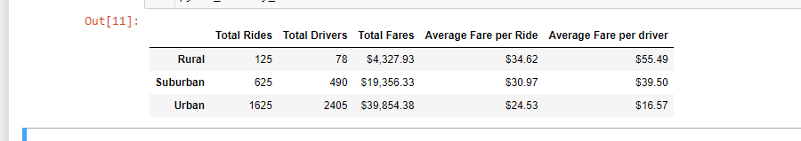

# PyBer_Analysis

## Overview of the analysis:

The analysis is carried out on the three types of cities namely Urban, Suburban and Rural to see how the number of rides, drivers, total fares average fares vary by the type of city.

## Results:

### Summary:

    1. The ride shares are most common in Urban areas as people dont prefer to own cars probably because of less space. When compared to Urban area suburbs have lesser rides as people prefer to own cars.  And in the Rural are there even fewer car rides.
    2. The drivers too are more in the Urban cities when compared to the suburban and rural cities as more car rides are required in the urban city.
    3. The total faires too follow a pattern like the drivers count - most in the urban cities, then in the Suburban cities and least in the Rural cities.
    4. Average fare per ride and Average fare per driver are both more in the Rural area following in the suburban cities and the least in the urban cities.

## Recommendations to address disparities among the city types:

1. 